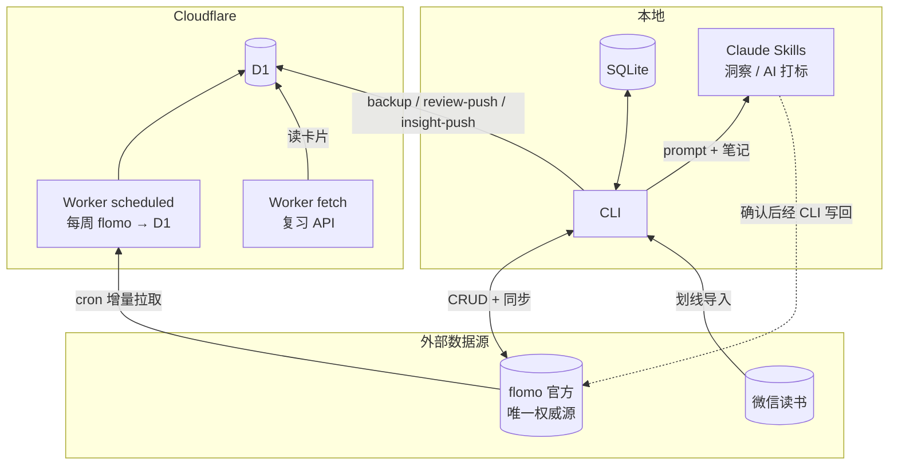

# flomo-insight

把 flomo（浮墨笔记）同步到本地与 Cloudflare，并用本地 LLM 做洞察与标签整理。

**flomo 是唯一权威源。** 本地和 Cloudflare 对称：先改 flomo，成功后再写自己的副本（本地 SQLite / D1）。智能只发生在本地 Claude；Python 与 Worker 只搬运数据。

---

## 架构一览

Agent 规则见 **`AGENTS.md`**；产品边界见 `docs/PRD.md`。



| 端 | 能做什么 | 不能做什么 |
|----|----------|------------|
| 本地 | 同步、CRUD、`push` 草稿、微信读书、LLM 洞察/打标、推 D1 | 不替代 flomo 权威；LLM 产物写入前须确认 |
| Worker | 每周 cron 镜像 flomo→D1；对外复习读 API | 不对外 sync/CRUD；不生成洞察 |
| D1 | 云端副本 + 复习卡 | 只保留最新表结构；非完整可还原库 |

写路径：**先 flomo，成功后再写本地 SQLite / D1。**

---

## 快速开始

```bash
git clone <repo>
cd flomo-insight
uv sync
cp config.toml.example config.toml
```

编辑 `config.toml`：

```toml
flomo_token = "..."      # Chrome DevTools → Network → /api/ 请求头 Authorization: Bearer <token>
weread_key = ""          # 可选，微信读书 Skills API key（wrk-...）
d1_database_id = ""      # 可选，D1 UUID（本地直接推 D1 时用）
db_path = "data/flomo.db"
```

首次同步：

```bash
flomo sync
```

---

## 本地 CLI

### 同步与笔记

```bash
flomo sync                      # 增量：flomo → 本地 SQLite
flomo sync --full               # 全量重新拉取
flomo create "内容" --tags "AI,学习"
flomo update <slug> --content "新内容"
flomo delete <slug>
flomo push                       # 将 source=local 的草稿 create 到 flomo，再写回本地
flomo search "关键词" --tags "AI"
flomo recent -n 20
flomo tags
```

写路径：**先调用 flomo API，成功后再更新本地 SQLite**。  
> flomo 无公开 Open API，本项目使用其 Web 内部接口 + MD5 签名。

### 微信读书

```bash
flomo import weread             # 拉划线+书评，输出 LLM 打标 prompt
flomo import weread --auto      # 仅打 #微信读书 后直接写入 flomo
flomo weread-stats
```

打标与过滤规则见 Skills。

### 洞察（LLM，非脚本）

Python **不生成洞察结论**，只打包「指令 + 笔记原文」：

```bash
flomo perspectives              # 列出 11 种类型
flomo insight topics            # 输出 prompt + 笔记，交给 Claude 写分析
```

类型：

- 分析型：`topics` / `stagnant` / `declining` / `connections` / `draft`
- 视角型：`default` / `value-clarification` / `inversion` / `second-order` / `cbt` / `mbti`

Claude 写完洞察后，可推到 D1 复习：

```bash
flomo insight-push --type topics --file insight.md
```

### 标签整理（LLM）

```bash
flomo retag                     # 输出 taxonomy + 笔记，供 Claude 重新打标
```

### 复习数据

```bash
flomo review-push               # 本地清理原文卡并 upsert 到 D1.daily_reviews
```

说明：会保留已有 `served_count`（轮转进度），不会整表重建。

### 其它

```bash
flomo backup                    # 本地 memos 增量 upsert 到 D1（可选，与 cron 互补）
flomo stats
flomo config show
flomo version
```

> 本版本起**不再提供 MCP Server**。Agent 请使用 CLI + Skills。

---

## Cloudflare Worker

Worker 做两件事：

1. **Cron 同步**（`scheduled`）：按 `worker/wrangler.toml` 的 `[triggers] crons` 定时执行  
2. **复习 API**（`fetch`）：`GET /?key=REVIEW_KEY` 轮转返回一张卡  

```
cron → scheduled()
         ├─ FLOMO_TOKEN → 增量 flomo → D1.memos（游标 sync_state）
         └─ WEREAD_KEY  → 微信读书 → flomo → D1（仅 #微信读书，无 LLM）
HTTP GET /?key=REVIEW_KEY[&kind=memo|insight|all] → D1.daily_reviews
```

代码：`worker/review-worker.js`。Wrangler / D1 / Cron 的通用用法见 [Cloudflare 文档](https://developers.cloudflare.com/workers/)。

### 项目相关配置

| 项 | 位置 | 说明 |
|----|------|------|
| Cron 表达式 | `worker/wrangler.toml` → `[triggers] crons` | 默认 `23 2 * * 1`（UTC，每周一 02:23，仅 flomo→D1） |
| D1 绑定 | 同文件 `[[d1_databases]]` | `database_id` 须与本地 `d1_database_id` 一致 |
| `REVIEW_KEY` | Worker secret | 对外复习 API 唯一鉴权 |
| `FLOMO_TOKEN` | Worker secret | cron 调 flomo；与本地 `flomo_token` 相同 |
| `FLOMO_SIGN_SALT` | Worker secret / 本地 `flomo_sign_salt` | 请求签名盐（从 flomo 网页 bundle 提取，**不入库**） |
| `WEREAD_KEY` | Worker secret（可选） | cron 自动导入微信读书 |

部署与改 secret / 触发器：用 wrangler 或 Cloudflare 控制台即可，本仓库不再展开。

### Cron 行为

每次触发：

1. 确保 D1 存在 `memos` / `daily_reviews` / `sync_state`
2. 有 `FLOMO_TOKEN`：增量拉 flomo，upsert `memos`，删除项 DELETE，推进游标
3. 有 `WEREAD_KEY`：拉有书评的划线 → 写 flomo → 写 D1（去重 `weread_imports`）

**不做**：生成洞察、对外 sync/CRUD、无 token 时的任何拉取。

### 复习 API

```bash
curl "https://<your-worker>/?key=<REVIEW_KEY>"
curl "https://<your-worker>/?key=<REVIEW_KEY>&kind=insight"
```

- 错误鉴权：`401`
- `served_count` 最小优先，服务后 `+1`
- `kind`：`memo` | `insight` | 省略/`all` 混合

### 与本地 CLI

| | Worker cron | 本地 |
|--|-------------|------|
| 触发 | Cloudflare 定时 | 手动 |
| 数据落点 | D1 | SQLite |
| 洞察 | 无 | LLM Skills + `insight-push` |

同一 `d1_database_id` 时，本地 `backup` / `review-push` 与 Worker 写同一套表。

---

## 数据模型（D1）

只保留**最新 schema**，不做旧表兼容。若线上仍是旧结构，`DROP` 对应表后重新 `backup` / `review-push` 一次即可。

### `memos`（云端镜像）

`slug, content, tags, source, created_at, updated_at, backed_up_at`

- `content`：笔记原文（与本地 SQLite `memos.content` 一致）
- `tags`：逗号分隔标签名，来自本地 `memo_tags`（或 Worker 从 flomo 响应解析）

### `daily_reviews`（复习卡）

`id, kind, slug, content, insight_type, date, served_count, created_at`

- `kind=memo`：笔记原文（去 HTML / 去正文内标签，便于阅读）
- `kind=insight`：LLM 洞察全文，`insight_type` 如 `topics`

### 本地 SQLite（洞察/打标数据源）

`memos` 含 **`tags_llm_at`**：`NULL` 表示尚未被 LLM 优化标签；非空为已处理时间戳。  
`flomo retag` 默认只处理 `tags_llm_at IS NULL` 的笔记。

---

## Skills（本地 Claude 使用）

| Skill | 路径 | 用途 |
|-------|------|------|
| 洞察 | `.claude/skills/insight/` | 11 种类型；**insight-push 前须确认** |
| 打标 | `.claude/skills/tagging/` | 仅 pending；方案→确认→update→tags-optimized |
| 复习 | `.claude/skills/review/` | review-push / insight-push |
| 备份 | `.claude/skills/backup/` | 本地 backup 与 Worker cron 分工 |

**Agent 上手顺序**：`AGENTS.md` → 对应 Skill → CLI。不要期待 MCP。

---

## 项目结构

```
flomo_insight/
├── main.py           # CLI 入口
├── config.py
├── api/              # flomo HTTP + MD5 签名 + 限速
├── sync/             # flomo ↔ SQLite（local_write）
├── search/           # FTS5
├── insight/          # 洞察 prompt 打包（不生成结论）
├── importers/        # 微信读书
├── tags/             # taxonomy + retag（tags_llm_at）
├── review/           # 卡片清理 + push
├── backup/           # 本地推 D1
└── db/               # SQLite schema / migrations
worker/               # Worker（scheduled + 复习 API）
.claude/skills/       # insight / tagging / review / backup
docs/                 # PRD、TODO
AGENTS.md             # 分层架构 + Agent 手册
```

---

## 同步语义

| 场景 | 行为 |
|------|------|
| 本地 sync | 增量拉 flomo → upsert SQLite |
| 本地 CRUD | 先 flomo 成功 → 再写 SQLite |
| 本地 ↔ flomo 冲突 | `updated_at` 较新的一方胜 |
| Worker cron（镜像） | 读 flomo → upsert D1；不会反向改 flomo |
| Worker cron（微信读书） | 读 weread → create flomo → 再镜像到 D1 |
| 删除 | 本地 delete 会删 flomo；D1 不自动删行（镜像策略可在后续迭代收紧） |

---

## 开源与安全

提交前确认不包含：

- `config.toml`（token / key）
- 真实 `worker/wrangler.toml`（域名、D1 UUID）
- `data/`、`*.db`、`.wrangler/`、调试截图

```bash
git ls-files | grep -iE 'config\.toml$|wrangler\.toml$|\.db$'
git diff --cached | grep -iE 'Bearer |wrk-|REVIEW_KEY|flomo_token'
```

---

## 技术栈

- Python 3.11+ / Typer / httpx / pydantic
- SQLite + FTS5
- Cloudflare Workers + D1
- Claude Code Skills（本地 LLM）
